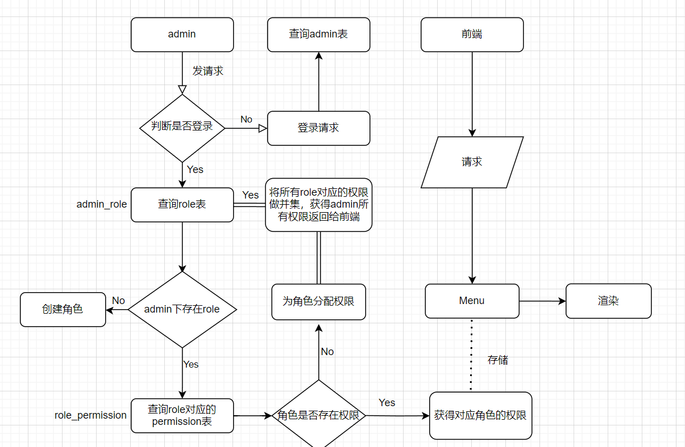

#### 权限设计
1、管理员登录完成 
2、在系统中创建不同的角色，每个角色代表一组权限 
3、在系统中定义不同的权限，每个权限代表系统中的某个功能或资源 
4、管理员通过前端管理界面，选择相应的角色。在界面上展示系统中已存在的权限列表，管理员通过勾选或其他方式选择需要分配的权限 
5、根据管理员登录状态，决定在前端显示登录后的界面，包括不同的导航栏和功能模块。 
6、根据管理员的角色和权限信息，在前端动态渲染相应的菜单项和功能按钮。 
7、通过前端路由控制，只展示管理员有权限访问的页面和功能 

